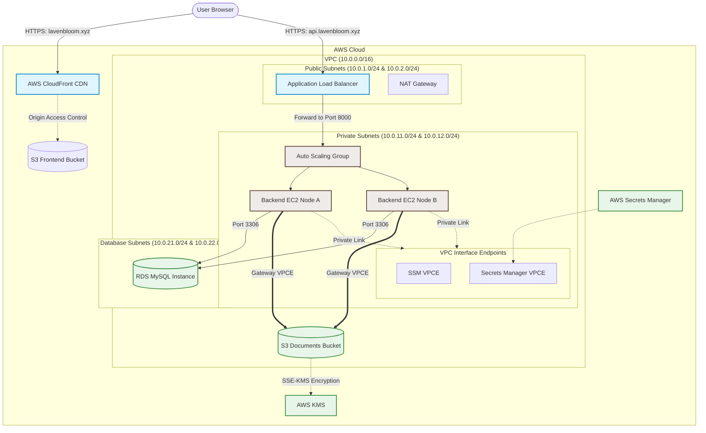

# AWS Production Infrastructure & Services: Comprehensive Study Guide

This study guide provides a detailed breakdown of the production-grade, highly available AWS cloud infrastructure designed for the **Patient Management System**. The entire infrastructure is defined as Code (IaC) and provisioned using **Terraform**.

---

## 🏛️ Architecture Philosophy & Design Patterns

The architecture is built around three core pillars: **Security (HIPAA/PHI compliance)**, **High Availability (HA)**, and **Operational Efficiency**. 

### 1. Zero-Trust Network Isolation (Defense in Depth)
Any system dealing with Personal Health Information (PHI) must enforce absolute data isolation. This infrastructure implements a three-tier network architecture:
*   **Public Tier**: Only contains components that directly face the internet (Route 53, CloudFront CDN, and the Application Load Balancer).
*   **Private Compute Tier**: Contains backend API nodes in an Auto Scaling Group. They have **no public IP addresses** and cannot be reached directly from the internet.
*   **Database Tier**: Contains the managed RDS MySQL database instance, completely isolated from any internet ingress and only accessible from the private compute nodes.

### 2. High Availability (HA) & Redundancy
*   All resources span across two distinct AWS Availability Zones (AZs): `us-east-1a` and `us-east-1b`.
*   The compute tier uses an **Auto Scaling Group (ASG)** to scale out or replace unhealthy instances automatically.
*   An **Application Load Balancer (ALB)** dynamically routes incoming API requests across AZs.

### 3. Serverless Frontend Distribution
By hosting static frontend assets (compiled React build) on **S3** and distributing them via the **CloudFront CDN**, the architecture avoids running web servers (like Nginx) on EC2 instances. This reduces infrastructure costs, provides instant global scalability, and eliminates web server maintenance.

---

## 🗺️ Architecture Topology Diagram

The diagram below visualizes the flow of requests from users to the backend services, highlighting the network boundaries and integration points.

---

## 🛠️ AWS Services Catalog: Deep-Dive

This section maps out every AWS service utilized in the codebase, detailing its configuration in Terraform, its runtime function, and the value it adds.

### 1. AWS VPC (Virtual Private Cloud)
*   **What it is**: A logically isolated virtual network dedicated to your AWS account.
*   **How it is configured**: Created using the official AWS VPC module. It divides the `10.0.0.0/16` CIDR block into 6 subnets across two AZs:
    *   2 Public Subnets: `10.0.1.0/24` and `10.0.2.0/24`
    *   2 Private Subnets: `10.0.11.0/24` and `10.0.12.0/24`
    *   2 Database Subnets: `10.0.21.0/24` and `10.0.22.0/24`
    *   A single NAT Gateway is set up in a public subnet to allow private resources to download updates/packages during bootstrapping.
*   **How it helps the application**: Acts as the foundation of network isolation, ensuring that backend systems and databases have no direct exposure to the public internet.
*   **Code Reference**: [main.tf (VPC Block)](file:///c:/Users/RAPHEL%20M%20L/Desktop/patient-mngt-v2/terraform/main.tf#L2-L43)

### 2. AWS EC2 & Auto Scaling Group (ASG)
*   **What it is**: Elastic virtual servers in the cloud (EC2) managed by an automated scaling layer (ASG).
*   **How it is configured**: 
    *   Uses a **Launch Template** to configure Ubuntu 22.04 servers (`t3.micro`), mapping a 20 GB encrypted EBS root volume (`gp3`).
    *   An **Auto Scaling Group** handles scaling (Min: 1, Max: 2, Desired: 1).
    *   Instances launch strictly in **Private Subnets** without public IP addresses.
    *   Uses a **User-Data Bootstrapping Script** to automate node configurations on startup.
*   **How it helps the application**: Provides scalable compute resources. In the event of traffic spikes, the ASG scales out. If an instance crashes, the ASG immediately replaces it to preserve service availability.
*   **Code Reference**: [asg/main.tf](file:///c:/Users/RAPHEL%20M%20L/Desktop/patient-mngt-v2/terraform/modules/asg/main.tf) and [launch-template/main.tf](file:///c:/Users/RAPHEL%20M%20L/Desktop/patient-mngt-v2/terraform/modules/launch-template/main.tf)

### 3. AWS RDS (Relational Database Service) - MySQL
*   **What it is**: A managed, production-grade relational database service.
*   **How it is configured**: Deploys a MySQL 8.4 engine on `db.t3.micro` instance with 20 GB storage (auto-scales up to 50 GB). Set to `publicly_accessible = false` within private database subnets.
*   **How it helps the application**: Offloads administrative burdens such as manual database backups, OS patches, and hardware scaling. It secures sensitive patient profiles and system schemas inside private network boundaries.
*   **Code Reference**: [rds/main.tf](file:///c:/Users/RAPHEL%20M%20L/Desktop/patient-mngt-v2/terraform/modules/rds/main.tf)

### 4. Amazon S3 (Simple Storage Service)
*   **What it is**: A highly durable object storage service with built-in encryption and access controls.
*   **How it is configured**:
    *   **Frontend Bucket**: Stores static HTML/JS/CSS assets. Block Public Access is fully enabled. CloudFront accesses it securely via an Origin Access Control (OAC) principal.
    *   **Documents Bucket**: Stores patient medical records. Versioning is enabled to recover from accidental deletions. Configured with Server-Side Encryption using AWS KMS (SSE-KMS) with a Customer Managed Key.
*   **How it helps the application**: Provides scalable, durable, and highly secure storage. The document bucket handles HIPAA-grade security natively at rest, and the frontend bucket enables serverless web hosting.
*   **Code Reference**: [s3/main.tf](file:///c:/Users/RAPHEL%20M%20L/Desktop/patient-mngt-v2/terraform/modules/s3/main.tf) and [frontend/main.tf](file:///c:/Users/RAPHEL%20M%20L/Desktop/patient-mngt-v2/terraform/modules/frontend/main.tf)

### 5. AWS CloudFront (Content Delivery Network)
*   **What it is**: A globally distributed content delivery network (CDN).
*   **How it is configured**:
    *   Points to the static frontend S3 bucket as its origin.
    *   Configured with **Origin Access Control (OAC)** to sign requests to S3 via Signature Version 4.
    *   Utilizes a custom error behavior to rewrite 403 and 404 responses to `/index.html` (HTTP 200), allowing client-side React Router navigation to function seamlessly.
    *   Terminates HTTPS traffic using SSL certificates managed by ACM.
*   **How it helps the application**: Serves user interface assets with sub-millisecond latency from global edge locations, shielding the S3 origin from public internet load.
*   **Code Reference**: [frontend/main.tf (CloudFront Block)](file:///c:/Users/RAPHEL%20M%20L/Desktop/patient-mngt-v2/terraform/modules/frontend/main.tf#L34-L90)

### 6. AWS Application Load Balancer (ALB)
*   **What it is**: An intelligent OSI Layer-7 load balancer that routes HTTP/HTTPS requests.
*   **How it is configured**:
    *   Sits in the public subnets, acting as the single gateway for API requests (`api.lavenbloom.xyz`).
    *   The HTTP listener (port 80) redirects all requests to HTTPS (port 443) using HTTP 301.
    *   The HTTPS listener (port 443) terminates SSL/TLS and forwards traffic to the backend ASG target group on port 8000.
    *   Maintains a health check path at `/health` to ensure traffic is only routed to healthy nodes.
*   **How it helps the application**: Provides elastic traffic routing, SSL termination, and prevents client exposure to internal IP addresses.
*   **Code Reference**: [asg/main.tf (ALB Block)](file:///c:/Users/RAPHEL%20M%20L/Desktop/patient-mngt-v2/terraform/modules/asg/main.tf#L1-L66)

### 7. AWS Secrets Manager
*   **What it is**: A secure secret storage and lifecycle management service.
*   **How it is configured**: Stores database connection strings (host, username, password), JWT signature keys, bucket names, and regions as encrypted JSON.
*   **How it helps the application**: Prevents hardcoding secrets in the codebase. The backend retrieves configuration strictly at startup, maintaining credentials strictly in-memory.
*   **Code Reference**: [secrets/main.tf](file:///c:/Users/RAPHEL%20M%20L/Desktop/patient-mngt-v2/terraform/modules/secrets/main.tf)

### 8. AWS Key Management Service (KMS)
*   **What it is**: Cryptographic key management service for creating and controlling keys.
*   **How it is configured**: Provisions a dedicated Customer Managed Key (CMK) with automated key rotation enabled.
*   **How it helps the application**: Provides cryptographic enforcement for patient documents. AWS manages physical key security, while S3 leverages this key to encrypt data transparently when files are uploaded.
*   **Code Reference**: [kms/main.tf](file:///c:/Users/RAPHEL%20M%20L/Desktop/patient-mngt-v2/terraform/modules/kms/main.tf)

### 9. AWS IAM (Identity & Access Management)
*   **What it is**: Access management framework that regulates authorization policies.
*   **How it is configured**:
    *   Creates an IAM Role and Instance Profile for EC2 instances.
    *   Configures a least-privilege policy allowing reading the specific app secret, listing and performing object operations on the S3 documents bucket, and utilizing the S3 KMS key.
    *   Attaches the AWS-managed policy `AmazonSSMManagedInstanceCore` to enable Systems Manager access.
*   **How it helps the application**: Eliminates static AWS credentials (access keys/secret keys) on instances, securing node identity.
*   **Code Reference**: [iam/main.tf](file:///c:/Users/RAPHEL%20M%20L/Desktop/patient-mngt-v2/terraform/modules/iam/main.tf)

### 10. Route 53 (DNS)
*   **What it is**: A highly available and scalable cloud Domain Name System (DNS) service.
*   **How it is configured**: Configures Route 53 A records pointing the primary domain to the CloudFront distribution, and the `api.` subdomain to the ALB as DNS aliases.
*   **How it helps the application**: Maps user domains to the appropriate AWS resources.
*   **Code Reference**: [dns/main.tf](file:///c:/Users/RAPHEL%20M%20L/Desktop/patient-mngt-v2/terraform/modules/dns/main.tf)

---

## 🔐 Security Configuration Matrix

Traffic within the VPC is restricted using specific security groups. The tables below show how network paths are secured:

### Network Access Control (Security Groups)

| Security Group | Direction | Allowed Port / Protocol | Source / Destination | Purpose |
| :--- | :--- | :--- | :--- | :--- |
| **ALB SG** | Ingress | `80` & `443` (TCP) | `0.0.0.0/0` (Anywhere) | Receives internet traffic |
| | Egress | `8000` (TCP) | Internal Backend SG | Forwards traffic to compute instances |
| **Backend SG** | Ingress | `8000` (TCP) | Internal ALB SG | Only accepts traffic from the Load Balancer |
| | Egress | `All` | `0.0.0.0/0` (Anywhere) | Outbound for packages/API calls |
| **RDS SG** | Ingress | `3306` (TCP) | Internal Backend SG | Only accepts connections from backend servers |
| | Egress | None | N/A | Strictly isolated database |
| **VPC Endpoint SG**| Ingress | `443` (TCP) | VPC CIDR `10.0.0.0/16` | Receives private AWS API traffic |

---

## ⚡ Technical Deep-Dives

### 1. Application Bootstrapping Flow (Launch Templates & User-Data)
When a backend instance boots, it is provisioned completely from scratch:
1.  **OS Preparation**: It runs a shell script under root permissions.
2.  **Code Fetching**: It installs git and clones the repository branch configured by the `git_repo_url` and `git_tag` variables.
3.  **Python Virtualenv**: It creates a python environment, upgrades `pip`, and installs backend dependencies from `requirements.txt`.
4.  **Systemd Setup**: It installs Gunicorn and registers a systemd service (`patient-app.service`) to keep the FastAPI server running.
5.  **Secure Configuration**: The systemd service is configured with environment variable overrides pointing to the AWS Secret Name and AWS region. This allows the backend code to fetch secrets securely at runtime.
*   **Reference Code**: [user-data.sh.tftpl](file:///c:/Users/RAPHEL%20M%20L/Desktop/patient-mngt-v2/terraform/modules/launch-template/templates/user-data.sh.tftpl)

### 2. Runtime Secrets Integration
Instead of reading configuration from local `.env` files, the application fetches credentials dynamically on boot:
*   FastAPI calls the Secrets Manager endpoint via `boto3` inside [aws.py](file:///c:/Users/RAPHEL%20M%20L/Desktop/patient-mngt-v2/backend/app/utils/aws.py#L58-L78).
*   The connection string for SQLAlchemy is built dynamically: `mysql+pymysql://<user>:<password>@<host>/<database>`.
*   JWT signing keys and bucket names are loaded directly into application memory (`settings`).
*   This approach ensures credentials are never stored on the local disk.

### 3. S3 KMS Encryption & SigV4 Pre-signed URLs
When storing sensitive patient files, standard public links cannot be used. Instead, the application generates **Pre-signed URLs** that expire after one hour.
*   **The Technical Trap**: If an S3 bucket is encrypted using an AWS KMS key, AWS requires **Signature Version 4 (SigV4)** to authorize requests.
*   **The Code Solution**: When initializing `boto3.client("s3")`, the client must be configured with `Config(signature_version="s3v4")`. Failing to do so causes AWS to reject requests with a signature mismatch error.
*   **Code Implementation**: Configured in [aws.py](file:///c:/Users/RAPHEL%20M%20L/Desktop/patient-mngt-v2/backend/app/utils/aws.py#L12-L36).

### 4. Gateway vs. Interface VPC Endpoints
To avoid routing traffic over the public internet, the VPC uses **VPC Endpoints (PrivateLink)**:
*   **Interface Endpoints (SSM, Secrets Manager)**: These provision elastic network interfaces (ENIs) inside the private subnets with private IP addresses, acting as entry points for service APIs.
*   **Gateway Endpoints (S3)**: Instead of routing traffic through network interfaces, S3 uses a gateway endpoint. This updates the VPC route tables, sending S3 traffic directly to the service without traversing network interfaces. This design improves bandwidth and reduces data transfer costs.

---

## 🎓 Self-Assessment / Interview Prep Questions

Here are some typical questions you might face in a technical review or system design interview regarding this architecture:

### Q1: Why are the backend EC2 instances running inside private subnets if they need to serve API traffic? How does a user interact with them?
> **Answer**: The instances run in private subnets to protect them from direct internet exposure. A user interacts with them through the Application Load Balancer (ALB). The ALB sits in the public subnets (which have an internet gateway) and forwards traffic to the backend instances on port 8000. Additionally, backend security groups are configured to only allow inbound traffic from the ALB's security group, blocking all other external requests.

### Q2: Why is the backend fetching credentials from AWS Secrets Manager at startup instead of reading from a local `.env` file?
> **Answer**: Using AWS Secrets Manager ensures credentials are not stored on local disks or committed to git repositories, which mitigates the risk of credential leaks. Credentials are loaded strictly into memory. Secrets Manager also allows for centralized credential management, automated secret rotation, and access logging.

### Q3: Why is SigV4 required when generating S3 pre-signed URLs for patient documents in this project?
> **Answer**: The patient documents S3 bucket is encrypted using a Customer Managed Key (CMK) in AWS KMS. When a client requests a file using a pre-signed URL, AWS must authorize both the S3 read operation and the KMS decryption operation. This multi-resource authorization requires Signature Version 4 (SigV4) to secure the request parameters.

### Q4: If the backend EC2 instances have no public IPs and SSH ports are closed, how can an administrator connect to them for debugging?
> **Answer**: Administrators connect securely using **AWS Systems Manager (SSM) Session Manager**. The backend instances are assigned an IAM role with the `AmazonSSMManagedInstanceCore` policy. The instance registers with Systems Manager via VPC interface endpoints. Administrators can launch secure shell sessions through the AWS CLI or Console without exposing SSH ports or requiring SSH keys.

### Q5: What is the benefit of hosting the frontend React app on S3 + CloudFront compared to running an Nginx web server on EC2?
> **Answer**: Hosting the frontend on S3 and CloudFront is serverless. It eliminates the cost, maintenance, and vulnerabilities associated with managing EC2 instances. CloudFront distributes the assets globally to edge locations, reducing load times. Additionally, S3 has built-in high availability and durability, meaning the frontend scales automatically without requiring Auto Scaling Groups or Load Balancers.
